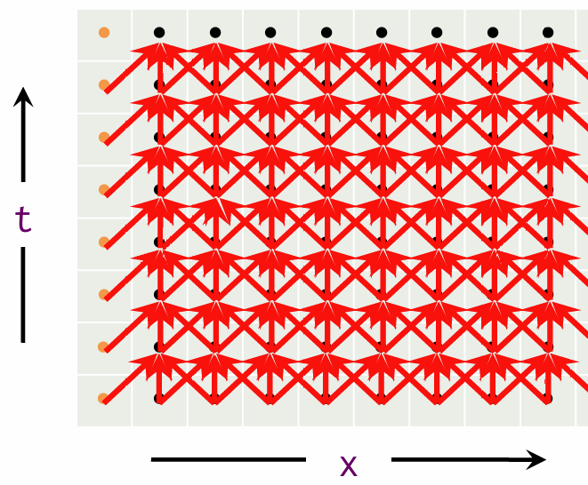

> deadline 2024.12.12 00:00

## 实验简介

### 负责助教

* [范意阳](22307110117@m.fudan.edu.cn)
* [孔令宇](22307110120@m.fudan.edu.cn)
* [徐厚泽](22307110054@m.fudan.edu.cn)

### 前言

CSAPP第6章配套实验。  
本实验的目的是加深同学们对高速缓存cache认识。实验分为三个部分：

-   part A：用c语言设计一个cache模拟器，它能读入特定格式的trace文件（trace文件中模拟了一系列的对存储器的读写操作），并且输出cache的命中、缺失、替换次数；我们会为你提供一部分代码
-   part B：根据特定的cache参数设计一个矩阵转置的算法，使得矩阵转置运算中cache的miss次数尽可能低。
-   part C：设计一个 Cache Oblivious 算法

本次实验参考CMU CSAPP课程的[Cache Lab](http://csapp.cs.cmu.edu/3e/labs.html)。  
考虑到pj将至，助教将本次lab的难度相较于原版调低了一些（除了honor-part，但honor-part的分数很少），而且本次实验全程用c语言（可以不用和抽象的汇编打交道了），所以大家不用过于担心~~~

### 分值分配

-   part A: `40%`
-   part B: `34%`
-   part C: `11%`
-   实验报告+代码风格：`15%`

## 部署实验环境

### （1）下载

从 Github Classroom 中`clone`本次作业仓库

### （2）准备工作

#### 确保已安装了 gcc

在终端中检查是否安装了 gcc：

<table><tbody><tr><td><pre><span>1</span><br></pre></td><td><pre><span>gcc -v</span><br></pre></td></tr></tbody></table>

如果已安装，终端将会反馈版本信息，否则会反馈 `command not found` 。  
如未安装，尝试执行以下命令进行安装：

<table><tbody><tr><td><pre><span>1</span><br></pre></td><td><pre><span>sudo apt-get install gcc</span><br></pre></td></tr></tbody></table>

#### 确保已安装了 make

检查是否安装 make，在终端输入：

<table><tbody><tr><td><pre><span>1</span><br></pre></td><td><pre><span>make -v</span><br></pre></td></tr></tbody></table>

同理，如未安装，尝试以此执行以下命令：

<table><tbody><tr><td><pre><span>1</span><br><span>2</span><br><span>3</span><br></pre></td><td><pre><span>sudo apt-get update</span><br><span>sudo apt-get install make</span><br><span>sudo apt-get install libc6 libc6-dev libc6-dev-i386</span><br></pre></td></tr></tbody></table>

#### 确保安装python3

<table><tbody><tr><td><pre><span>1</span><br></pre></td><td><pre><span>python3 --version</span><br></pre></td></tr></tbody></table>

一般情况下系统是自带python的  
如未安装，请自行上网搜索安装教程

#### 安装valgrind

<table><tbody><tr><td><pre><span>1</span><br></pre></td><td><pre><span>sudo apt-get install valgrind</span><br></pre></td></tr></tbody></table>

## part A

### intro

设计一个cache模拟器，读入指定格式的trace文件，模拟cache的运行过程，然后输出cache的命中、缺失、替换次数  
trace文件是通过`valgrind`的[lackey](https://valgrind.org/docs/manual/lk-manual.html)工具生成的，它具有以下格式

<table><tbody><tr><td><pre><span>1</span><br><span>2</span><br><span>3</span><br><span>4</span><br></pre></td><td><pre><span>I 0400d7d4,8</span><br><span> M 0421c7f0,4</span><br><span> L 04f6b868,8</span><br><span> S 7ff0005c8,8</span><br></pre></td></tr></tbody></table>

每行格式为

<table><tbody><tr><td><pre><span>1</span><br></pre></td><td><pre><span>[space]operation address,size</span><br></pre></td></tr></tbody></table>

其中`I`代表读指令操作，`L`代表读数据操作，`S`代表写数据操作，`M`代表修改数据操作（即读数据后写数据）。**除了`I`操作外，其他操作都会在开头都会有一个空格**。`address`为操作的地址，`size`为操作的大小（单位为字节）。

### to-do

你的所有实现都在`csim.c`和`csim.h`中

你的全局变量和函数需要定义在`csim.h`中，你的函数实现需要在`csim.c`中

我们提供了一个`csim-ref`的文件，是一个参考实现，你可以通过它来检查你的实现是否正确，它的用法如下：

<table><tbody><tr><td><pre><span>1</span><br></pre></td><td><pre><span>./csim-ref [-hv] -s &lt;s&gt; -E &lt;E&gt; -b &lt;b&gt; -t &lt;tracefile&gt; -q &lt;policy&gt;</span><br></pre></td></tr></tbody></table>

-   `-h`代表帮助
-   `-v`代表verbose，即输出详细信息
-   `-s`代表cache的set数
-   `-E`代表每个set中的cache line数
-   `-b`代表cache line的大小（单位为字节）
-   `-t`代表trace文件的路径
-   `-q`代表cache line的替换策略，0代表`LRU` 1代表`2Q`

`csim-ref`会输出cache的命中、缺失、替换次数，比如：

```shell
# verbose = false
./csim-ref -s 16 -E 1 -b 16 -t traces/yi.trace
hits:4 misses:5 evictions:3

# verbose = true
$ ./csim-ref -v -s 16 -E 1 -b 16 -t traces/yi.trace
L 10,1 miss 
M 20,1 miss hit 
L 22,1 hit 
S 18,1 hit 
L 110,1 miss eviction 
L 210,1 miss eviction 
M 12,1 miss eviction hit 
hits:4 misses:5 evictions:3y
```

你的实现需要具有和`csim-ref`相同的功能，包括verbose模式输出debug信息

在`csim.c`中，我们已经为你提供了基本的解析命令行参数的代码，你需要在此基础上进行实现

你需要将cache的替换策略改为`LRU`算法与`2Q`算法

#### `2Q`算法

传统的 LRU 策略虽然简单，但存在以下几个问题：

1. **缓存污染问题**：
   - 当访问模式中出现大量 “一次性访问” 的数据时，这些数据会占据缓存空间，导致真正频繁使用的数据被驱逐。
   - 例如，如果缓存大小为 4，而访问序列为 `A -> B -> C -> D -> E -> A -> B -> C -> D`，则 `E` 的一次性访问会导致 `A, B, C, D` 被逐出缓存，影响命中率。
2. **短期热点问题**：
   - 如果某些数据短时间内被频繁访问（称为短期热点），LRU 会将其直接提升为缓存中的重要数据，但热点可能很快消失，导致缓存效率下降。

2Q 策略通过引入两个队列解决了这些问题：

- 短期访问的数据首先进入 `A1-in`，而不是直接进入长期队列 `Am`。
- 如果数据再次被访问，才会被提升到长期队列 `Am`，表明其具有长期价值。

> [!TIP]
>
> 请你思考，相对于`LRU`的替换策略，为什么`2Q`有以上优点却没有被大规模使用。 （1分）

---

2Q 策略的缓存分为两个队列：

1. **A1-in**（FIFO 队列）：
   - 用于存储最近访问的缓存数据。
   - 这是一个短期队列，本实验的大小设计为与每个set中的cache line数相同。
   - 数据首次访问时会被插入到 `A1-in`。
   - 如果 `A1-in` 满了，新数据会替换最早插入的数据（FIFO 替换）。

2. **Am**（LRU 队列）：
   - 用于存储频繁访问的缓存数据。
   - 这是一个长期队列，本实验的大小设计为与每个set中的cache line数相同。
   - 只有当 `A1-in` 中的数据被再次访问时，才会被提升到 `Am`。
   - 如果 `Am` 满了，新数据会替换最久未使用的数据（LRU 替换）。
   - 只有从cache中删除，才算eviction。

---

#### 数据访问时的处理流程：

1. **检查 Am**：
   - 如果数据在 `Am` 中，命中缓存（**hit**），更新数据在 `Am` 中的 LRU 状态，将其移到队尾。

2. **检查 A1-in**：
   - 如果数据在 `A1-in` 中，不算命中（**miss**），但将其从 `A1-in` 中移除，并提升到 `Am`。
   - 如果 `Am` 满了，按照 LRU 策略移除最久未使用的数据。

3. **不在缓存中**：
   - 如果数据既不在 `A1-in` 也不在 `Am`，则是一次完全的未命中（**miss**）。
   - 将数据插入到 `A1-in`。
   - 如果 `A1-in` 满了，按照 FIFO 策略移除最早插入的数据。

---

### requirements

-   你的代码在编译时不能存在warning
-   你 **只能** 使用c语言来实现（助教看不懂c++和python）
-   虽然给了测试数据，但不允许面向数据编程，助教会做源码检查；不允许通过直接调用`csim-ref`来实现

### evaluation

共有10项测试

```shell
$ ./csim -s 1 -E 1 -b 12 -t traces/yi2.trace -q LRU
$ ./csim -s 4 -E 2 -b 20 -t traces/yi.trace -q LRU
$ ./csim -s 2 -E 1 -b 20 -t traces/dave.trace -q LRU
$ ./csim -s 2 -E 1 -b 16 -t traces/trans.trace -q LRU
$ ./csim -s 2 -E 2 -b 16 -t traces/trans.trace -q LRU
$ ./csim -s 2 -E 4 -b 16 -t traces/trans.trace -q LRU
$ ./csim -s 5 -E 1 -b 32 -t traces/trans.trace -q LRU
$ ./csim -s 5 -E 1 -b 32 -t traces/long.trace -q LRU
$ ./csim -s 5 -E 1 -b 32 -t traces/trans.trace -q 2Q
$ ./csim -s 5 -E 1 -b 32 -t traces/long.trace -q 2Q
```


得分为：前7项每项`3`分，最后3项`6`分，共`39`分；对于每一项，`hit, miss, eviction`的正确性各占`1/3`的分数

最终的分数可以通过`./driver.py`来查看

### hints

-   使用`malloc`和`free`来构造cache
-   你可以使用`csim-ref`来检查你的实现是否正确，通过开启verbose模式可以更好地debug
-   `LRU`算法可以简单地使用计数器的实现方式
-   为了简化实验，我们默认一次操作一定可以在一个cache line内完成；也就意味着，你无需处理size和cache line大小两个参数。
-   你可以使用`queue.h`来进行构建，也可以自己编写其他的数据结构进行实现
-   对于具体如何实现没有太多要求，大家八仙过海各显神通~~~

## part B

### intro

cache为何被称为“高速缓存”，是因为读取cache的速率远快于读取主存的速率（可能大概100倍），因此cache miss的次数往往决定了程序的运行速度。因此，我们需要尽可能设计cache-friendly的程序，使得cache miss的次数尽可能少。

在这部分的实验，你将对矩阵转置程序（一个非常容易cache miss的程序）进行优化，让cache miss的次数尽可能少。你的分数将由cache miss的次数决定

### to-do

你的所有实现都将在`trans.c`中

你将设计这样的一个函数：它接收四个参数：M，N，一个N \* M的矩阵A和一个M \* N的矩阵B，你需要把A转置后的结果存入B中。

<table><tbody><tr><td><pre><span>1</span><br><span>2</span><br><span>3</span><br><span>4</span><br><span>5</span><br></pre></td><td><pre><span><span>char</span> trans_desc[] = <span>"some description"</span>;</span><br><span><span>void</span> <span>trans</span><span>(<span>int</span> M, <span>int</span> N, <span>int</span> A[N][M], <span>int</span> B[M][N])</span></span><br><span>{</span><br><span>    </span><br><span>}</span><br></pre></td></tr></tbody></table>

每设计好一个这样的函数，你都可以在`registerFunctions()`中为其进行“注册”，只有“注册”了的函数才会被加入之后的评测中，你可以“注册”并评测多个函数；为上面的函数进行注册只需要将下面代码加入`registerFunctions()`中

<table><tbody><tr><td><pre><span>1</span><br></pre></td><td><pre><span>registerTransFunction(trans, trans_desc);</span><br></pre></td></tr></tbody></table>

我们提供了一个名为`trans()`的函数作为示例

你需要保证有一个且有唯一一个“注册”的函数用于最终提交，我们将靠“注册”时的description进行区分，请确保你的提交函数的description是“Transpose submission” ，比如

<table><tbody><tr><td><pre><span>1</span><br><span>2</span><br><span>3</span><br><span>4</span><br><span>5</span><br></pre></td><td><pre><span><span>char</span> transpose_submit_desc[] = <span>"Transpose submission"</span>;</span><br><span><span>void</span> <span>transpose_submit</span><span>(<span>int</span> M, <span>int</span> N, <span>int</span> A[N][M], <span>int</span> B[M][N])</span></span><br><span>{</span><br><span>    </span><br><span>}</span><br></pre></td></tr></tbody></table>

我们将使用特定形状的矩阵和特定参数的cache来进行评测，所以你 **可以** 针对这些特殊情况来编写代码

### requirements

-   你的代码在编译时不能存在warning
-   在每个矩阵转置函数中，你至多能定义12个int类型的局部变量（不包括循环变量，但你不能将循环变量用作其他用途），且不能使用任何全局变量。你不能定义除int以外类型的变量。你不能使用malloc等方式申请内存块。你可以使用int数组，但等同于数组大小的数量的int类型变量也同样被计入
-   你不能使用递归
-   你只允许使用一个函数完成矩阵转置的功能，而不能在函数中调用任何辅助函数
-   你不能修改原始的矩阵A，但是你可以任意修改矩阵B
-   你可以定义宏

### evaluation

我们将使用cache参数为：`s = 48, E = 1, b = 48`，即每个cache line大小为48字节，共有48个cache line，每个set中只有1个cache line。  
我们将使用以下2种矩阵来进行评测 

- 48 \* 48的矩阵，分值`15`分，miss次数`< 500`则满分，miss次数`> 800`则0分，`500~800`将按miss次数获取一定比例的分数 
  - 若`<450`，则获得2分荣誉分
- 96 \* 96的矩阵，分值`15`分，miss次数`< 2200`则满分，miss次数`> 3000`则0分，`2200~3000`将按miss次数获取一定比例的分数 
  - 若`<1900`，则获得2分荣誉分

我们只会针对这两种矩阵进行测试，所以你 **可以** 只考虑这两种情况

#### step 0

<table><tbody><tr><td><pre><span>1</span><br></pre></td><td><pre><span>make clean &amp;&amp; make</span><br></pre></td></tr></tbody></table>

#### step 1

在测试之前，进行算法正确性的测试

<table><tbody><tr><td><pre><span>1</span><br></pre></td><td><pre><span>./tracegen -M &lt;row&gt; -N &lt;col&gt;</span><br></pre></td></tr></tbody></table>

比如对48 \* 48转置函数进行测试

<table><tbody><tr><td><pre><span>1</span><br></pre></td><td><pre><span>./tracegen -M 48 -N 48</span><br></pre></td></tr></tbody></table>

你也可以对特定的函数进行测试，比如对第0个“注册”的函数

<table><tbody><tr><td><pre><span>1</span><br></pre></td><td><pre><span>./tracegen -M 48 -N 48 -F 0</span><br></pre></td></tr></tbody></table>

#### step 2

<table><tbody><tr><td><pre><span>1</span><br></pre></td><td><pre><span>./test-trans -M &lt;row&gt; -N &lt;col&gt;</span><br></pre></td></tr></tbody></table>

这个程序将使用valgrind工具生成trace文件，然后调用csim-ref程序获取cache命中、缺失、替换的次数

### hints

-   在调用`./test-trans`之后，可以使用如下命令查看你的cache命中/缺失情况；你可以把`f0`替换为`fi`来查看第 i 个“注册”的函数带来的cache命中/缺失情况

<table><tbody><tr><td><pre><span>1</span><br></pre></td><td><pre><span>./csim-ref -v -s 48 -E 1 -b 48 -t trace.f0 &gt; result.txt</span><br></pre></td></tr></tbody></table>

-   [这篇文章可能对你有所启发](http://csapp.cs.cmu.edu/public/waside/waside-blocking.pdf)
-   cache的关联度为1，你可能需要考虑冲突带来的miss
-   脑测一下你的miss次数或许是一个很好的选择，你可以计算一下大概有多少比例的miss，然后乘以总的读写次数；你可以在上面生成的`result.txt`文件中验证你的想法
-   你可以认为A和B矩阵的起始地址位于某个cacheline的开始（即A和B二维数组的起始地址能被48整除）

## part C

### intro

在 part B 的矩阵转置算法中，我们指定了 cache 的参数，并进行了有针对性的优化。然而，在现实世界中，开发者是难以获取 cache 的具体参数的。我们希望在各种不同的 cache setting 下，一个算法都能尽可能地高效利用缓存。这就是所谓的 [Cache Oblivious Algorithm]([Cache-oblivious algorithm - Wikipedia](https://en.wikipedia.org/wiki/Cache-oblivious_algorithm))。

在这部分的实验，我们将会尝试实现 Cache Oblivious 的一维物体热传递数值模拟算法。


一维物体的热传递可以由下面的公式给出：$$\frac{\partial u}{\partial t} = \alpha \frac{\partial^2 u}{\partial x^2}$$，其中 $u(x,t)$表示温度分布，$\alpha$ 为热扩散系数。

进行一些~~简单的~~数学推导，我们可以得到：$$\frac{u(t + \Delta t, x) - u(t, x)}{\Delta t} =  \alpha \left( \frac{u(t, x + \Delta x) - 2u(t, x) + u(t, x - \Delta x)}{(\Delta x)^2} \right)$$

更形象化地来说，记`u[t][x]`表示点`x`在`t`时间的温度，那么`t+1`时刻的温度可以如下计算：

```c
u[t+1][x] = u[t][x] + ALPHA *(u[t][x+1] -2*u[t][x] + u[t][x-1]);
```



给定`t=0`时刻各点的初始温度，我们希望计算出`t=T`时刻各点的温度。

### requirements

你需要在`heat-sim/heatsim.c`中实现函数`void heat_sim(int T, int N, int A[T][N])`，尽可能地降低Cache Miss次数。

传入的`A[0][0]~A[0][N-1]`表示初始状态各点的温度。在$\alpha=1,\Delta t=1$参数下，你需要计算出每个时刻每点的温度，并保存在`A`中。

- 你可以调用给出的`kernel`函数计算下一时刻某一点处的温度。

- 由于计算`A[t+1][x]`需要用到`A[t][x-1]`和`A[t][x+1]`，为了避免数组越界，对于`1<=t<T`，你只需要计算`A[t][1~N-2]`，无需计算`A[t][0]`和`A[t][N-1]`。
- 你的算法不应该有针对 Cache 参数（`s`，`E`，`b`）的优化

### evaluation

为了实现 Cache Oblivious 性质，我们将会在`s=16, b=16, E={1,4,8}`三种 cache setting 下分别对你的算法进行测试，测试参数为`T=100, N=512`。

由于不同算法的访存次数可能不同，我们用 miss rate=$miss/(miss+hit)$来评估算法对缓存的利用效率。

<table><tbody><tr><td><pre><span>1</span><br></pre></td><td><pre><span>cd heat-sim && make && ./test-heat</span><br></pre></td></tr></tbody></table>

我们在`heat_sim_example`中提供了最朴素的算法。不妨先运行一下，观察miss随 cache setting 的变化情况。为什么会有这种情况？（2分）

实现你的算法后，重新编译并运行`test-heat`。

若你的miss小于等于下面的条件，该测试点将获得3分。（共9分）

| E    | miss rate |
| ---- | --------- |
| 16   | 0.12      |
| 32   | 0.10      |
| 64   | 0.078     |

## 评分

在项目根目录下

<table><tbody><tr><td><pre><span>1</span><br></pre></td><td><pre><span>python3 ./driver.py</span><br></pre></td></tr></tbody></table>

注意请保证在项目根目录和`./heat-sim`目录下都已经`make`过了

`heatsim`运行略慢，~~请耐心等待~~

## 提交实验

### （1）内容要求

你需要提交：

-   csim.c
-   csim.h
-   trans.c
-   heatsim.c
-   一份实验报告

实验报告应该包含以下内容：

-   实验标题，你的姓名，学号。
-   你在终端中执行`./driver.py`后的截图。
-   描述你每个部分实现的思路，要求简洁清晰。
-   如果有，请务必在报告中列出引用的内容以及参考的资料。
-   对本实验的感受（可选）。
-   对助教们的建议（可选）。

### （2）格式要求

可提交`.md`文件或者`.pdf`文件。不要提交`.doc`或`.docx`文件。

## 参考资料

-   [原版Cache Lab](http://csapp.cs.cmu.edu/3e/labs.html)
-   [C语言处理参数的 getopt() 函数](https://blog.csdn.net/rangfei/article/details/126845978)
